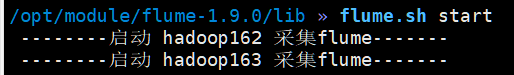

## 前言
本次gmall-realtime开发只涉及 ods、dim、dwd、dws。至于ads,实时和离线不一样,离线的需要落盘,需要单独开发,但实时中直接和可视化结合,无需提前聚合,也会更加灵活。

tips 该环境下z命令变成j命令 工作原理是通过记录目录的访问频率和时间，结合模糊匹配算法，快速跳转到目标目录。它的核心思想是基于习惯的智能推荐，非常适合需要频繁切换目录的用户

### 数据仓库 && 数据库
1. **数仓与数据库的区别**:数仓处理历史数据,数据库只看最新数据。
2. **数仓的核心架构**:包括业务数据和用户行为数据。
   
   - nginx负载均衡
   - 对于日志数据先落盘(当然MongoDB 是一个基于文档的数据库,特别适合存储 JSON 格式的数据,并且在游戏开发中被广泛使用。)
   - 日志数据通过flume、kafka(缓冲)进入Hadoop
   - 业务数据也增量全量地进入Hadoop

至此,上面的部分和离线内容基本一样。对于实时:
- 计算变成了flink,上图的clickhouse在该项目应该是doris
- 数据到了kakfa就相当于到了ods,所有的表进入到一个topic
- 维度表过滤出来存入dim层(存到哪)
- DWD层事实表存储在DWD层,DWS层:小批量汇总在DWS层。
详情见下图:


### 建模
- **ER 模型**:避免冗余,节约资源
  
  
  
  这种建模方法的出发点是整合数据,其目的是将整个企业的数据进行组合和合并,并进行规范处理,减少数据冗余性,保证数据的一致性。这种模型并不适合直接用于分析统计。

- **维度模型**
  维度建模将数据表分为事实表和维度表,事实表存储业务过程数据,维度表存储描述性数据。
  - **事实表**:细长,列少但数据量大,存储业务过程数据。
    - 1. **事务型事实表**:每条数据记录一个业务事件,如订单。(实时只用这个)
    - 2. **周期快照事实表**:每日或定期全量数据,如每日销售数据。
    - 3. **累计快照事实表**:类似于周期快照,但包含更多历史数据。
  - **维度表**:宽表,存储描述性数据,如用户信息、商品信息等。

设计事务事实表时一般可遵循以下四个步骤:
1. **选择业务过程**:确定感兴趣的业务分析点。通常情况下,一个业务过程对应一张事务型事实表。
2. **声明粒度**:选择最细粒度,确保聚合的灵活性。
3. **确定维度**:确定表与哪些维度相关,选择合适的维度。尽量多。
4. **确定事实**:确定表需要哪些指标,选择合适的度量值。

### 不足
1. **存量型指标**
   假设我们有一个电商平台,用户可以获取和使用虚拟货币。我们有两张事务型事实表:
   - 获取货币事实表:记录用户获取虚拟货币的所有操作。
   - 使用货币事实表:记录用户使用虚拟货币的所有操作。
   现在我们需要统计每个用户截至当日的虚拟货币余额。为了计算余额,我们需要:
   - 从 **获取货币事实表** 中获取每个用户的总获取金额。
   - 从 **使用货币事实表** 中获取每个用户的总使用金额。
   - 用总获取金额减去总使用金额,得到每个用户的余额。
   这种方法需要对两张表进行全表扫描和聚合,逻辑复杂且效率低下。

2. **多事务关联统计**
   假设我们需要统计最近 30 天内用户从下单到支付的平均时间间隔。我们有两张事务型事实表:
   - 下单事实表:记录用户的下单操作。
   - 支付事实表:记录用户的支付操作。
   为了计算平均时间间隔,我们需要:
   - 从 **下单事实表** 中筛选出最近 30 天的下单记录。
   - 从 **支付事实表** 中筛选出最近 30 天的支付记录。
   - 按照订单 ID 将两张表进行关联,计算每个订单的支付时间减去下单时间。
   - 计算所有订单的时间间隔的平均值。
   这种方法需要对两张大表进行关联操作,效率较低。

### 数仓设计

1. **数据调研**:明确业务需求和数据域。业务调研和需求分析,划分数据域的意义是便于数据的管理和应用(数据域是对数据的分类,主题域和业务域是对业务的分类。主题域和数据域最终都是对数据的分类,只是一个是数据视角,一个是业务视角。)
   
   
2. **业务建模**:构建业务主题矩阵。矩阵的行是一个个业务过程,矩阵的列是一个个的维度,行列的交点表示业务过程与维度的关系。
3. **指标明确**:明确统计指标。
   
4. **模型设计**:包括汇总模型设计。一张汇总表通常包含业务过程相同、统计周期相同、统计粒度相同的多个派生指标。
5. **开发调度**:完成数据开发和调度。
   

### 数仓分层
#### ods
- **原始数据层**
- **存储位置**: kafka
  - **topic**:
    - **日志**
      - 数据采集的数据到了kakfa, 其实就是ods层
        - ods_log(topic)
    - **业务数据**
      - maxwell(业务数据到了实时采集到mysql)
        - ods_db(topic)

#### dim
- **维度**
- **存储位置**:
  - 存入到支持sql的数据库中
    - 查询的频率比较高, 数据量还比较大
    - **mysql**: 可以选, 不是很好
    - **hbase+Phoenix**: 可以接入在线业务. 使用这个
      - 公司不是很方便
    - **es**: 支持 sql
      - dsl 也可以直接读
    - **redis**: 主要在容器
    - **hive**: 不行
- **维度的用法**:
  - 假设有订单数据
    - user_id   province_id
    - 根据各种id查找对应的维度信息
    - user_1     province_1
    - 随机查找
      - `select ... from dim where id=?`

#### dwd
- **来源于ods**
- **数据明细层**
  - **日志**: 启动、页面日志、曝光、活动、错误
    - **分流**:
      - 每种日志写入到不同的topic中
      - 用的流的方式
        - 侧输出流
  - **业务**: 事实表、维度
    - 只管理事实表
    - 对感兴趣的业务进行处理
      - 会对一些特别频繁使用的维度做退化,退化到事实表
    - 使用sql技术
      - join ...
- **存储位置**:
  - kafka, 给dws使用
- **总结**
  - 1.DWD层作为数据明细层,负责存储明细数据。
  - 2.明细数据的存储位置根据使用场景而定,可能需要支持轻度聚合操作。(进入kafka以支持dws的flink轻度汇总)
  - 3.DWD层处理日志数据时,通过分流技术将不同类型日志写入不同topic,便于后续分析处理。

#### dws
- **数据汇总层**
  - **轻度汇总**
    - 小窗口(预聚合)
    - 0-10
    - 10-20
- **存储到哪里**?
  - 支持sql的数据
    - hbase+Phoenix 不选
    - clickhouse olap
    - doris olap
- **总结**
  - 1.实时数据处理要求系统能够根据前端需求进行灵活的实时汇总。
  - 2.小窗口汇总策略适用于实时数据处理场景,可以在不预先知道所有数据的情况下进行汇总。
  - 3.汇总的时间窗口长度可以根据需求灵活调整,以满足不同时间粒度的汇总需求。
  - 4.最终汇总通常通过SQL语句和分组聚合操作完成,需要支持循环查询的数据库支持。

#### ads
- **最终的汇总**
  - 非常的灵活
- **不做落盘**, 根据前端的需求, 实时的汇总
  - `select .. from t where time >=.. and time <= ... group by ...`


## 数据采集 
关键词: **Flume kafka zookeeper MySQL Maxwell**


`/opt/module/flume-1.9.0/job » vim file_to_kafka.conf   `
```properties
#为各组件命名
a1.sources = r1
a1.channels = c1


#描述source
a1.sources.r1.type = TAILDIR
a1.sources.r1.filegroups = f1
a1.sources.r1.filegroups.f1 = /opt/module/applog/log/app.*
a1.sources.r1.positionFile = /opt/module/flume-1.9.0/taildir_position.json
a1.sources.r1.interceptors =  i1
a1.sources.r1.interceptors.i1.type = com.atguigu.flume.interceptor.ETLInterceptor$Builder

#描述channel
a1.channels.c1.type = org.apache.flume.channel.kafka.KafkaChannel
a1.channels.c1.kafka.bootstrap.servers = hadoop162:9092,hadoop163:9092,hadoop164:9092
a1.channels.c1.kafka.topic = ods_log
a1.channels.c1.parseAsFlumeEvent = false

#绑定source和channel以及sink和channel的关系
a1.sources.r1.channels = c1
```

-   **a1.sources = r1**: 定义了一个名为 `r1` 的 source。
    
-   **a1.sources.r1.type = TAILDIR**: 使用 `TAILDIR` 类型的 source,这种类型的 source 可以监控指定目录下的文件,并实时读取新增的内容。
    
-   **a1.sources.r1.filegroups = f1**: 定义了一个文件组 `f1`。
    
-   **a1.sources.r1.filegroups.f1 = /opt/module/applog/log/app.**\*: 文件组 `f1` 监控 `/opt/module/applog/log/` 目录下以 `app.` 开头的文件。
    
-   **a1.sources.r1.positionFile = /opt/module/flume-1.9.0/taildir\_position.json**: 指定一个位置文件,用于记录每个文件的读取位置,确保 Flume 重启后能够从上次读取的位置继续读取。
    
-   **a1.sources.r1.interceptors = i1**: 定义了一个拦截器 `i1`。
    
-   **a1.sources.r1.interceptors.i1.type = com.atguigu.flume.interceptor.ETLInterceptor$Builder**: 使用自定义的拦截器 `ETLInterceptor`,这个拦截器用`flume-interceptor-1.0-SNAPSHOT-jar-with-dependencies.jar
`位于
-------------------------------------------
- **a1.channels = c1**: 定义了一个名为 `c1` 的 channel。
- **a1.channels.c1.type = org.apache.flume.channel.kafka.KafkaChannel**: 使用 `KafkaChannel`,这意味着数据会直接发送到 Kafka,而不是先存储在 Flume 的内存或文件系统中。
- **a1.channels.c1.kafka.bootstrap.servers = hadoop162:9092,hadoop163:9092,hadoop164:9092**: 指定 Kafka 集群的 broker 地址。
- **a1.channels.c1.kafka.topic = ods_log**: 指定数据发送到 Kafka 的 `ods_log` topic。
- **a1.channels.c1.parseAsFlumeEvent = false**: 设置为 `false` 表示数据以原始格式发送到 Kafka,而不是作为 Flume 事件发送。

对配置有疑问可以点击跳转,或者打开目录查看注释里面的flume(以下再不赘述)
[Flume常用配置](#1)

启动即可

展示一下模拟**日志数据**

这个时候zookeeper flume kafka都得启动
然后consume ods_log 
再启动一个窗口

模拟**业务数据**

mock里面有建表的脚本
直接可以建出来


**Maxwell配置**

启动` maxwell.sh start   `
```properties
log_level=info

producer=kafka
kafka.bootstrap.servers=hadoop162:9092,hadoop163:9092,hadoop164:9092
mock_date=2025-1-14

#kafka topic修改配置
kafka_topic=ods_db
# mysql login info
host=hadoop162
user=root
password=aaaaaa
jdbc_options=useSSL=false&serverTimezone=Asia/Shanghai

# 指定 Kafka Producer 按照主键分区
producer_partition_by=table
```

这段 Maxwell 配置文件的含义是:
1. Maxwell 以 `info` 级别输出日志。
2. 将 MySQL 的 binlog 数据实时同步到 Kafka。
3. Kafka 集群的地址是 `hadoop162:9092,hadoop163:9092,hadoop164:9092`。
4. 数据发送到 Kafka 的 `ods_db` Topic。
5. 按照表名进行 Kafka 分区。**主要保证同一张表的数据有顺序**(如果不这样的话kafka可能会通过轮询...等把数据弄到不同topic)
6. 连接 MySQL 的地址是 `hadoop162`,用户名为 `root`,密码为 `aaaaaa`,并禁用 SSL 连接,设置时区为上海时区。

[Maxwell常用配置](#2)

遇到问题kafka没有数据可以测试一下

`/opt/software/mock/mock_db » kafka-console-producer.sh --broker-list localhost:9092 --topic ods_db`
`/opt/software/mock/mock_db » kafka-console-producer.sh --broker-list localhost:9092 --topic ods_db `
***注意Maxwell的日期格式Maxwell 无法解析日期字段 2025-1-15，因为其格式不符合 yyyy-MM-dd***多看日志
为了之后maxwel和生成业务数据的时间统一
> 有脚本change_db_date.sh
现在数据已经到了ods_db(kafka)

下一步

drawio文件请查看
图解\ods-flink-dim.drawio
**这是维度表怎么配置的三种方案**


数据可以产生之后就考虑一点etl

数据格式大约是

```Java
    private SingleOutputStreamOperator<JSONObject> etl(DataStreamSource<String> stream) {
        return stream
            .filter(json -> {
                try {
                    
                    JSONObject obj = JSON.parseObject(json.replaceAll("bootstrap-", ""));
                    
                    return "gmall2022".equals(obj.getString("database"))
                        && (
                        "insert".equals(obj.getString("type"))
                            || "update".equals(obj.getString("type")))
                        && obj.getString("data") != null
                        && obj.getString("data").length() > 2;
                    
                    
                } catch (Exception e) {
                    System.out.println("json 格式有误, 你的数据是: " + json);
                    return false;
                }
            })
            .map(JSON::parseObject);  // 转成jsonObject,方便后序使用
        
    }
```
对于
bootstrap-insert\start\complete
可以看图解
对于维度数据在程序启动之前就可能有，我们只能检查变化数据，对于用bootstrap全量导入的数据在etl做检查

旧数据全量同步


```sql
/opt/software/mock » vim table_process.sql                                                   
CREATE TABLE `table_process` (
  `source_table` varchar(200) NOT NULL COMMENT '来源表',
  `sink_table` varchar(200) DEFAULT NULL COMMENT '输出表',
  `sink_columns` varchar(2000) DEFAULT NULL COMMENT '输出字段',
  `sink_pk` varchar(200) DEFAULT NULL COMMENT '主键字段',
  `sink_extend` varchar(200) DEFAULT NULL COMMENT '建表扩展',
  PRIMARY KEY (`source_table`)
) ENGINE=InnoDB DEFAULT CHARSET=utf8;

/*Data for the table `table_process` */
INSERT INTO `table_process`(`source_table`, `sink_table`, `sink_columns`, `sink_pk`, `sink_extend`) VALUES ('activity_info', 'dim_activity_info', 'id,activity_name,activity_type,activity_desc,start_time,end_time,create_time', 'id', NULL);
.........
```
这就是配置表
source_table 表示MySQL的表
sink_table表示Phoenix的表
sink_colums表示来源表所需要的列
sink_pk做主键hbase的rowkey

[flink-cdc](https://developer.aliyun.com/article/777502)


暂时使用flink-cdc做配置数据同步
业务数据也可以用flink-cdc代替MySQL-maxwell
[mysqlcdc](https://github.com/apache/flink-cdc/blob/master/docs/content.zh/docs/connectors/flink-sources/mysql-cdc.md)
1.flink-cdc2.x版本可以在mysqlcdc同时监控多张异构的表
| 特性                  | Flink CDC                          | MySQL + Maxwell                  |
|-----------------------|------------------------------------|----------------------------------|
| **支持数据库**         | MySQL、PostgreSQL、MongoDB 等      | 仅 MySQL                         |
| **全量 + 增量同步**    | 支持                               | 仅支持增量同步                   |
| **动态表发现**         | 支持                               | 不支持                           |
| **与实时计算集成**     | 直接集成 Flink，一体化实时计算      | 需要额外集成（如 Flink、Spark）   |
| **部署复杂度**         | 较高（需部署 Flink 集群）          | 较低（独立服务）                 |
| **适用场景**           | 实时数仓、数据湖、实时计算          | 数据管道、数据同步、日志分析      |


记得修改my.cnf确保数据库可以监控配置库的表变化

flink
最后读取的大概长这样
```json
{
    "before": {
        "id": 1,
        "name": "Alice",
        "age": 25,
        "email": "alice@example.com"
    },
    "after": {
        "id": 1,
        "name": "Alice",
        "age": 26,  // age 字段从 25 更新为 26
        "email": "alice@example.com"
    },
    "source": {
        "version": "1.9.7.Final",
        "connector": "mysql",
        "name": "mysql_binlog_source",
        "ts_ms": 1672502400000,
        "snapshot": "false",
        "db": "test_db",
        "table": "users",
        "server_id": 1,
        "file": "mysql-bin.000001",
        "pos": 12345,
        "row": 0,
        "thread": 1,
        "query": null
    },
    "op": "u",  // u 表示 UPDATE
    "ts_ms": 1672502400000
}
```
只需要读取after之后的 
再说一下动态建表相关
配置的数据会被广播放到  processBroadcastElement 会被重复建表（当然加判断逻辑也能避免），
[广播流建表](#3)


建表的时候我们发现有很多表带有

SALT_BUCKETS = 4（给出三个分界分出四个块然后rowkey去比较去到哪个块，这个是自动生成的，主键前面有随机值不会出现聚集在一个地方的情况）
 盐表

 ------------
 regionserver
 region
  数据

默认情况 建表一张表只有一个region

当region膨胀一定程度, 会自动分裂

    旧: 10G 一分为2

    新: ...

    hadoop162
     r1  r2

   自动迁移
    r2 迁移到163


jdbc在phoenix连接时八小时没有使用就会掐断
// 避免与服务器的长连接, 长时间没有使用, 服务器会自动关闭连接.
```java
if (conn.isClosed()) {
    conn = JdbcUtil.getPhoenixConnection();
}
```
也可以使用连接池使用druid

至此ods->dim结束可以打包到集群实验 避免资源不够用
bin/yarn-session.sh -d 在flink下后台yarn执行
bin/flink run -d -c  类名 jar地址和spark类似


# 注释


<p id="1"></p> 

## Flume

一个 Flume Agent 由三个核心组件组成:
1. **Source**(数据源)
2. **Channel**(数据通道)
3. **Sink**(数据目的地)

```properties
# 定义 Agent 的组件
AgentName.sources = SourceName
AgentName.channels = ChannelName
AgentName.sinks = SinkName

# 配置 Source
AgentName.sources.SourceName.type = SourceType
AgentName.sources.SourceName.属性 = 值

# 配置 Channel
AgentName.channels.ChannelName.type = ChannelType
AgentName.channels.ChannelName.属性 = 值

# 配置 Sink
AgentName.sinks.SinkName.type = SinkType
AgentName.sinks.SinkName.属性 = 值

# 绑定 Source 和 Channel
AgentName.sources.SourceName.channels = ChannelName

# 绑定 Sink 和 Channel
AgentName.sinks.SinkName.channel = ChannelName
```
---

### **1. Source(数据源)**
Source 是 Flume 的数据入口,负责从外部系统(如文件、Kafka、HTTP 等)收集数据。

#### 常见 Source 类型:
- **TAILDIR**:监控文件的变化,实时读取新增内容。
- **Exec Source**:执行一个命令(如 `tail -F`),读取命令的输出。
- **Spooling Directory Source**:监控一个目录,读取新增的文件。
- **Kafka Source**:从 Kafka 中消费数据。
- **HTTP Source**:通过 HTTP 请求接收数据。

#### 关键配置:
- **type**:指定 Source 的类型。
- **channels**:绑定到哪个 Channel。
- **filegroups**(TAILDIR):定义监控的文件组。
- **positionFile**(TAILDIR):记录文件读取位置的文件。
- **interceptors**:定义拦截器,用于对数据进行预处理。

---

### **2. Channel(数据通道)**
Channel 是 Source 和 Sink 之间的缓冲区,用于临时存储数据。

#### 常见 Channel 类型:
- **Memory Channel**:数据存储在内存中,速度快,但可能会丢失数据。
- **File Channel**:数据存储在本地文件中,可靠性高,但速度较慢。
- **Kafka Channel**:数据直接发送到 Kafka,兼具存储和传输功能。

#### 关键配置:
- **type**:指定 Channel 的类型。
- **capacity**:Channel 的最大容量。
- **transactionCapacity**:每次事务处理的最大事件数。
- **kafka.bootstrap.servers**(Kafka Channel):Kafka 集群地址。
- **kafka.topic**(Kafka Channel):数据发送到的 Kafka Topic。

---

### **3. Sink(数据目的地)**
Sink 是 Flume 的数据出口,负责将数据发送到外部系统(如 HDFS、Kafka、HBase 等)。

#### 常见 Sink 类型:
- **HDFS Sink**:将数据写入 HDFS。
- **Kafka Sink**:将数据发送到 Kafka。
- **Logger Sink**:将数据写入日志文件(用于调试)。
- **HBase Sink**:将数据写入 HBase。
- **File Roll Sink**:将数据写入本地文件。

#### 关键配置:
- **type**:指定 Sink 的类型。
- **channel**:绑定到哪个 Channel。
- **hdfs.path**(HDFS Sink):HDFS 的写入路径。
- **kafka.bootstrap.servers**(Kafka Sink):Kafka 集群地址。
- **kafka.topic**(Kafka Sink):数据发送到的 Kafka Topic。

---

### **4. Interceptors(拦截器)**
拦截器用于在数据进入 Channel 之前对其进行处理(如过滤、修改、添加头信息等)。

#### 常见拦截器:
- **Timestamp Interceptor**:为事件添加时间戳。
- **Host Interceptor**:为事件添加主机名。
- **Regex Filtering Interceptor**:根据正则表达式过滤事件。
- **Custom Interceptor**:自定义拦截器(如 `ETLInterceptor`)。

#### 关键配置:
- **type**:指定拦截器的类型。
- **属性**:拦截器的具体配置参数。

---

### **5. 绑定关系**
- **Source 和 Channel 绑定**:
  ```properties
  AgentName.sources.SourceName.channels = ChannelName
  ```
- **Sink 和 Channel 绑定**:
  ```properties
  AgentName.sinks.SinkName.channel = ChannelName
  ```

---

### **6. 示例配置解读**
以下是一个完整的 Flume 配置示例:
```properties
# 定义 Agent 的组件
a1.sources = r1
a1.channels = c1
a1.sinks = k1

# 配置 Source
a1.sources.r1.type = TAILDIR
a1.sources.r1.filegroups = f1
a1.sources.r1.filegroups.f1 = /opt/module/applog/log/app.*
a1.sources.r1.positionFile = /opt/module/flume/taildir_position.json
a1.sources.r1.interceptors = i1
a1.sources.r1.interceptors.i1.type = timestamp

# 配置 Channel
a1.channels.c1.type = memory
a1.channels.c1.capacity = 10000
a1.channels.c1.transactionCapacity = 1000

# 配置 Sink
a1.sinks.k1.type = hdfs
a1.sinks.k1.hdfs.path = hdfs://hadoop102:9000/flume/%Y-%m-%d/%H
a1.sinks.k1.hdfs.filePrefix = logs-
a1.sinks.k1.hdfs.fileType = DataStream

# 绑定 Source 和 Channel
a1.sources.r1.channels = c1

# 绑定 Sink 和 Channel
a1.sinks.k1.channel = c1
```

##### 解读:
1. **Source**:使用 `TAILDIR` 监控 `/opt/module/applog/log/app.*` 文件,并添加时间戳拦截器。
2. **Channel**:使用 `memory` 类型的 Channel,容量为 10000 个事件。
3. **Sink**:使用 `HDFS Sink`,将数据写入 HDFS,路径按日期和小时分区。
4. **绑定关系**:Source `r1` 和 Sink `k1` 都绑定到 Channel `c1`。

---

### **7. 常用命令**
- 启动 Flume Agent:
  ```bash
  flume-ng agent --conf conf --conf-file flume-conf.properties --name a1 -Dflume.root.logger=INFO,console
  ```
  - `--conf`:指定配置目录。
  - `--conf-file`:指定配置文件。
  - `--name`:指定 Agent 名称。

---
### **8.场景**
#### **1. 多 Agent 的场景**
当一个 Flume 配置文件中定义了多个 Agent 时,这些 Agent 是相互独立的,每个 Agent 都有自己的 Source、Channel 和 Sink。这种配置通常用于测试或简化管理多个 Agent 的场景。

##### 示例:一个配置文件中定义多个 Agent
```properties
# 定义第一个 Agent:a1
a1.sources = r1
a1.channels = c1
a1.sinks = k1

a1.sources.r1.type = TAILDIR
a1.sources.r1.filegroups = f1
a1.sources.r1.filegroups.f1 = /opt/module/applog/log/app.*
a1.sources.r1.positionFile = /opt/module/flume/taildir_position.json

a1.channels.c1.type = memory
a1.channels.c1.capacity = 10000

a1.sinks.k1.type = logger

a1.sources.r1.channels = c1
a1.sinks.k1.channel = c1

# 定义第二个 Agent:a2
a2.sources = r2
a2.channels = c2
a2.sinks = k2

a2.sources.r2.type = exec
a2.sources.r2.command = tail -F /opt/module/another_log.log

a2.channels.c2.type = memory
a2.channels.c2.capacity = 5000

a2.sinks.k2.type = hdfs
a2.sinks.k2.hdfs.path = hdfs://hadoop102:9000/flume/%Y-%m-%d/%H

a2.sources.r2.channels = c2
a2.sinks.k2.channel = c2
```

##### 解读:
- 这个配置文件中定义了两个独立的 Agent:`a1` 和 `a2`。
- `a1` 使用 `TAILDIR` Source 监控日志文件,并将数据发送到 Logger Sink。
- `a2` 使用 `Exec` Source 监控另一个日志文件,并将数据发送到 HDFS Sink。

##### 运行方式:
- 启动 `a1`:
  ```bash
  flume-ng agent --conf conf --conf-file flume-conf.properties --name a1 -Dflume.root.logger=INFO,console
  ```
- 启动 `a2`:
  ```bash
  flume-ng agent --conf conf --conf-file flume-conf.properties --name a2 -Dflume.root.logger=INFO,console
  ```

---

#### **2. 复杂的多级流(Multi-hop Flow)**
在某些复杂的场景中,Flume 的数据流可能需要经过多个 Agent 进行处理。这种情况下,可以在一个配置文件中定义多个 Agent,并通过 Kafka、Avro 等方式将数据从一个 Agent 传递到另一个 Agent。

##### 示例:多级流配置
```properties
# 定义第一个 Agent:a1(收集数据并发送到 Kafka)
a1.sources = r1
a1.channels = c1
a1.sinks = k1

a1.sources.r1.type = TAILDIR
a1.sources.r1.filegroups = f1
a1.sources.r1.filegroups.f1 = /opt/module/applog/log/app.*
a1.sources.r1.positionFile = /opt/module/flume/taildir_position.json

a1.channels.c1.type = memory
a1.channels.c1.capacity = 10000

a1.sinks.k1.type = org.apache.flume.sink.kafka.KafkaSink
a1.sinks.k1.kafka.bootstrap.servers = hadoop102:9092
a1.sinks.k1.kafka.topic = flume_topic

a1.sources.r1.channels = c1
a1.sinks.k1.channel = c1

# 定义第二个 Agent:a2(从 Kafka 消费数据并写入 HDFS)
a2.sources = r2
a2.channels = c2
a2.sinks = k2

a2.sources.r2.type = org.apache.flume.source.kafka.KafkaSource
a2.sources.r2.kafka.bootstrap.servers = hadoop102:9092
a2.sources.r2.kafka.topics = flume_topic

a2.channels.c2.type = memory
a2.channels.c2.capacity = 10000

a2.sinks.k2.type = hdfs
a2.sinks.k2.hdfs.path = hdfs://hadoop102:9000/flume/%Y-%m-%d/%H
a2.sinks.k2.hdfs.filePrefix = logs-
a2.sinks.k2.hdfs.fileType = DataStream

a2.sources.r2.channels = c2
a2.sinks.k2.channel = c2
```

##### 解读:
- **a1**:从日志文件中收集数据,并通过 Kafka Sink 将数据发送到 Kafka 的 `flume_topic`。
- **a2**:从 Kafka 的 `flume_topic` 消费数据,并通过 HDFS Sink 将数据写入 HDFS。

##### 运行方式:
- 启动 `a1`:
  ```bash
  flume-ng agent --conf conf --conf-file flume-conf.properties --name a1 -Dflume.root.logger=INFO,console
  ```
- 启动 `a2`:
  ```bash
  flume-ng agent --conf conf --conf-file flume-conf.properties --name a2 -Dflume.root.logger=INFO,console
  ```

---

#### **3. 多路复用(Multiplexing)**
在某些场景中,一个 Source 可能需要将数据分发到多个 Channel,然后由不同的 Sink 处理。这种情况下,可以在一个 Agent 中定义多个 Channel 和 Sink。

##### 示例:多路复用配置
```properties
# 定义 Agent:a1
a1.sources = r1
a1.channels = c1 c2
a1.sinks = k1 k2

# 配置 Source
a1.sources.r1.type = TAILDIR
a1.sources.r1.filegroups = f1
a1.sources.r1.filegroups.f1 = /opt/module/applog/log/app.*
a1.sources.r1.positionFile = /opt/module/flume/taildir_position.json

# 配置 Channel
a1.channels.c1.type = memory
a1.channels.c1.capacity = 10000

a1.channels.c2.type = memory
a1.channels.c2.capacity = 10000

# 配置 Sink
a1.sinks.k1.type = logger

a1.sinks.k2.type = hdfs
a1.sinks.k2.hdfs.path = hdfs://hadoop102:9000/flume/%Y-%m-%d/%H

# 绑定 Source 和 Channel
a1.sources.r1.channels = c1 c2

# 配置 Channel Selector(多路复用)
a1.sources.r1.selector.type = multiplexing
a1.sources.r1.selector.header = type
a1.sources.r1.selector.mapping.log = c1
a1.sources.r1.selector.mapping.data = c2

# 绑定 Sink 和 Channel
a1.sinks.k1.channel = c1
a1.sinks.k2.channel = c2
```

##### 解读:
- **Source**:从日志文件中收集数据。
- **Channel Selector**:根据事件的 `type` 头信息将数据分发到不同的 Channel:
  - 如果 `type=log`,数据发送到 `c1`,最终由 Logger Sink 处理。
  - 如果 `type=data`,数据发送到 `c2`,最终由 HDFS Sink 处理。


<p id="2"></p> 

## Maxwell
[官网](https://maxwells-daemon.io/config/)
这段配置是 **Maxwell** 的配置文件,Maxwell 是一个 MySQL 的实时数据抓取工具,可以将 MySQL 的 binlog 数据实时同步到 Kafka 或其他消息队列中。以下是对配置文件的逐行解读:


下面是涉及到的配置解读,更下面是知识点


**1. 日志级别**
```properties
log_level=info
```
- **作用**:设置 Maxwell 的日志级别。
- **值**:`info` 表示输出一般信息级别的日志。
- **其他可选值**:`debug`(调试信息)、`warn`(警告信息)、`error`(错误信息)。

---

**2. 生产者类型**
```properties
producer=kafka
```
- **作用**:指定 Maxwell 将数据发送到 Kafka。
- **值**:`kafka` 表示使用 Kafka 作为数据生产者。
- **其他可选值**:`stdout`(输出到控制台)、`file`(输出到文件)等。

---

**3. Kafka 集群地址**
```properties
kafka.bootstrap.servers=hadoop162:9092,hadoop163:9092,hadoop164:9092
```
- **作用**:指定 Kafka 集群的地址。
- **值**:Kafka Broker 的地址列表,用逗号分隔。
  - `hadoop162:9092`、`hadoop163:9092`、`hadoop164:9092` 是 Kafka Broker 的地址和端口。

---

**4. 模拟日期**
```properties
mock_date=2025-1-14
```
- **作用**:设置模拟日期,通常用于测试或调试。
- **值**:`2025-1-14` 表示将 Maxwell 的当前日期模拟为 2025 年 1 月 14 日。
- **注意**:这个配置通常只在测试环境中使用。

---

**5. Kafka Topic 配置**
```properties
kafka_topic=ods_db
```
- **作用**:指定 Maxwell 将数据发送到 Kafka 的哪个 Topic。
- **值**:`ods_db` 是 Kafka Topic 的名称。
- **注意**:如果未指定,Maxwell 会默认使用数据库名作为 Topic 名称。

---

**6. MySQL 连接信息**
```properties
host=hadoop162
user=root
password=aaaaaa
jdbc_options=useSSL=false&serverTimezone=Asia/Shanghai
```
- **作用**:配置 Maxwell 连接 MySQL 的相关信息。
- **字段说明**:
  - `host`:MySQL 服务器地址,这里是 `hadoop162`。
  - `user`:MySQL 用户名,这里是 `root`。
  - `password`:MySQL 密码,这里是 `aaaaaa`。
  - `jdbc_options`:JDBC 连接选项,这里是 `useSSL=false&serverTimezone=Asia/Shanghai`。
    - `useSSL=false`:禁用 SSL 连接。
    - `serverTimezone=Asia/Shanghai`:设置 MySQL 服务器的时区为上海时区。

---

**7. Kafka 分区策略**
```properties
producer_partition_by=table
```
- **作用**:指定 Kafka Producer 的分区策略。
- **值**:`table` 表示按照表名进行分区。
  - 这意味着同一张表的数据会被发送到 Kafka 的同一个分区中。
- **其他可选值**:
  - `primary_key`:按照主键分区。
  - `database`:按照数据库名分区。
  - `column`:按照指定列的值分区。

---


### **1. Maxwell 的核心功能**
1. **实时捕获 MySQL 变更**:
   - Maxwell 通过解析 MySQL 的 binlog,实时捕获数据库的变更事件。
   - 支持的操作包括:`INSERT`、`UPDATE`、`DELETE`。

2. **数据格式**:
   - Maxwell 输出的数据是 JSON 格式,包含表名、操作类型、变更前后的数据等信息。

3. **多种输出目标**:
   - Maxwell 支持将数据发送到多种目标,如 Kafka、RabbitMQ、文件、标准输出等。

4. **灵活的分区策略**:
   - Maxwell 支持按表、主键、数据库等策略对 Kafka 数据进行分区。

5. **轻量级**:
   - Maxwell 是一个独立的 Java 应用程序,不需要额外的中间件或服务。

---

### **2. Maxwell 的工作原理**
1. **基于 MySQL binlog**:
   - Maxwell 通过 MySQL 的 binlog 机制捕获数据变更。
   - binlog 是 MySQL 的二进制日志,记录了所有对数据库的修改操作。

2. **主从复制协议**:
   - Maxwell 模拟 MySQL 的从库,通过主从复制协议从主库获取 binlog 数据。

3. **数据解析**:
   - Maxwell 解析 binlog,提取出表名、操作类型、变更前后的数据等信息。

4. **数据输出**:
   - 将解析后的数据以 JSON 格式发送到指定的目标(如 Kafka)。

---

### **3. Maxwell 的配置**
Maxwell 的配置文件通常是一个 `.properties` 文件,以下是一些常见的配置项:

#### **1. 基本配置**
- **`log_level`**:日志级别,如 `info`、`debug`。
- **`producer`**:指定数据输出的目标,如 `kafka`、`stdout`。
- **`kafka.bootstrap.servers`**:Kafka 集群的地址。
- **`kafka_topic`**:指定 Kafka Topic 名称。
- **`mock_date`**:模拟日期,用于测试。

#### **2. MySQL 连接配置**
- **`host`**:MySQL 服务器地址。
- **`user`**:MySQL 用户名。
- **`password`**:MySQL 密码。
- **`jdbc_options`**:JDBC 连接选项,如 `useSSL=false&serverTimezone=Asia/Shanghai`。

#### **3. 分区策略**
- **`producer_partition_by`**:指定 Kafka 的分区策略,如 `table`、`primary_key`、`database`。

#### **4. 过滤配置**
- **`filter`**:指定过滤规则,只同步特定的数据库或表。
  - 例如:`filter=include:db1.*,exclude:db1.table1`。

#### **5. 其他配置**
- **`client_id`**:Maxwell 的客户端 ID,用于标识 Maxwell 实例。
- **`replication_host`**:指定 MySQL 主库的地址(默认使用 `host` 配置)。
- **`replication_user`**:指定 MySQL 主库的用户名(默认使用 `user` 配置)。
- **`replication_password`**:指定 MySQL 主库的密码(默认使用 `password` 配置)。

---

### **4. Maxwell 的数据格式**
Maxwell 输出的数据是 JSON 格式,包含以下字段:

#### **1. 基本字段**
- **`database`**:数据库名称。
- **`table`**:表名称。
- **`type`**:操作类型,如 `insert`、`update`、`delete`。
- **`ts`**:事件的时间戳(Unix 时间戳)。
- **`xid`**:事务 ID。
- **`commit`**:是否提交事务(`true` 或 `false`)。

#### **2. 数据字段**
- **`data`**:变更后的数据(`insert` 和 `update` 操作)。
- **`old`**:变更前的数据(`update` 和 `delete` 操作)。

#### **示例**
```json
{
  "database": "test_db",
  "table": "users",
  "type": "insert",
  "ts": 1672502400,
  "xid": 12345,
  "commit": true,
  "data": {
    "id": 1,
    "name": "Alice",
    "age": 25
  }
}
```

---

### **5. Maxwell 的使用场景**
1. **实时数据同步**:
   - 将 MySQL 的变更数据实时同步到 Kafka,供下游系统(如数据仓库、搜索引擎)使用。

2. **数据仓库构建**:
   - 将 MySQL 的数据实时同步到数据仓库(如 Hive、ClickHouse),用于数据分析。

3. **缓存更新**:
   - 将 MySQL 的变更数据实时同步到缓存系统(如 Redis),保持缓存与数据库的一致性。

4. **事件驱动架构**:
   - 将 MySQL 的变更数据作为事件发布到消息队列,驱动其他系统的业务逻辑。

---

### **6. Maxwell 的优缺点**

#### **优点**
1. **实时性**:
   - 基于 MySQL binlog,能够实时捕获数据变更。

2. **轻量级**:
   - 不需要额外的中间件,部署简单。

3. **灵活性**:
   - 支持多种输出目标和分区策略。

4. **易用性**:
   - 配置简单,易于集成到现有系统。

#### **缺点**
1. **依赖 MySQL binlog**:
   - 需要 MySQL 开启 binlog,并且 binlog 格式必须为 `ROW`。

2. **单点故障**:
   - Maxwell 是单点服务,如果 Maxwell 宕机,数据同步会中断。

3. **性能瓶颈**:
   - 在高并发场景下,Maxwell 可能成为性能瓶颈。

---

### **7. Maxwell 的部署与运行**

#### **1. 部署步骤**
1. **安装 Maxwell**:
   - 下载 Maxwell 的二进制包,解压到指定目录。

2. **配置 Maxwell**:
   - 修改 `config.properties` 文件,配置 MySQL 连接信息和输出目标。

3. **启动 Maxwell**:
   - 运行以下命令启动 Maxwell:
     ```bash
     bin/maxwell --config config.properties
     ```

#### **2. 运行模式**
- **守护进程模式**:
  - Maxwell 以后台进程运行,持续捕获 MySQL 的变更数据。
- **一次性模式**:
  - Maxwell 捕获一次变更数据后退出,适用于测试或调试。

---

### **8. Maxwell 的扩展与优化**

#### **1. 高可用**
- 部署多个 Maxwell 实例,通过负载均衡或故障切换机制实现高可用。

#### **2. 性能优化**
- 调整 Maxwell 的线程池大小和缓冲区大小,提高数据处理能力。
- 使用 Kafka 的分区机制,分散数据负载。

#### **3. 数据过滤**
- 使用 `filter` 配置,只同步需要的数据库或表,减少数据量。

#### **4. 监控与告警**
- 使用 Prometheus 或 Grafana 监控 Maxwell 的运行状态。
- 设置告警规则,及时发现和处理异常。

---

### **9. Maxwell 的替代方案**
1. **Debezium**:
   - 一个更强大的 CDC(Change Data Capture)工具,支持多种数据库(如 MySQL、PostgreSQL、MongoDB)。

2. **Canal**:
   - 阿里巴巴开源的 MySQL binlog 解析工具,支持将数据同步到 Kafka、RocketMQ 等。

3. **Flink CDC**:
   - 基于 Apache Flink 的 CDC 工具,支持实时数据同步和流式计算。


## 以下是Flink

<p id="3"></p> 

## 广播流建表避免重复

---

## **问题发生的原因**

### 1. **广播流的特性**
- **广播流**是 Flink 中一种特殊的数据流，它的数据会被复制并发送到所有下游任务的并行实例中。
- 广播流通常用于分发**全局配置**或**小数据集**，确保所有任务都能访问相同的数据。

### 2. **`processBroadcastElement` 的执行机制**
- `processBroadcastElement` 是 `BroadcastProcessFunction` 中用于处理广播流数据的方法。
- 每当广播流中有新的数据到达时，`processBroadcastElement` 都会被调用。
- 如果广播流中的数据频繁更新，或者作业的并行度较高，`processBroadcastElement` 可能会被频繁调用。

### 3. **重复建表的原因**
- 在 `processBroadcastElement` 中直接调用 `tableEnv.executeSql` 来执行建表语句，会导致以下问题：
  - **多次触发**：每次广播流数据到达时，都会尝试建表。
  - **并行任务独立执行**：每个并行任务都会独立调用 `processBroadcastElement`，导致重复建表。
  - **缺乏状态管理**：如果没有记录表是否已经创建，每次调用时都会尝试建表。

---

## **解决办法**

### 1. **在 `processBroadcastElement` 中添加状态管理**
- 使用 `BroadcastState` 来记录表是否已经创建。
- 只有在状态为 `null` 时，才执行建表语句。

**优点**：
- 避免重复建表。
- 逻辑清晰，易于实现。

**缺点**：
- 需要额外管理状态。
- 如果配置流中的数据频繁更新，可能会导致状态管理复杂。

**适用场景**：
- 配置流中的数据较少，且更新频率较低。

---

### 2. **在变成广播流之前建表**
- 在配置流变成广播流之前，先读取配置流中的数据，并执行建表语句。
- 建表完成后，再将配置流广播到所有并行任务。

**优点**：
- 建表逻辑只执行一次，避免重复建表。
- 逻辑分离，代码更清晰。
- 性能优化，减少在 `processBroadcastElement` 中的额外操作。

**缺点**：
- 如果配置流中的数据频繁更新，可能需要额外的逻辑来处理表更新。

**适用场景**：
- 配置流中的数据较少，且更新频率较低。
- 需要在作业启动时一次性加载配置。

---

### 3. **使用外部存储记录建表状态**
- 在作业外部（例如数据库或分布式缓存）记录表是否已经创建。
- 在 `processBroadcastElement` 中，先检查外部状态，再决定是否建表。

**优点**：
- 避免重复建表。
- 状态管理更灵活，适合分布式环境。

**缺点**：
- 需要依赖外部存储，增加了系统复杂性。
- 可能会引入额外的性能开销。

**适用场景**：
- 配置流中的数据频繁更新。
- 需要在多个作业之间共享状态。

---

## **扩展知识点**

### 1. **Flink 的状态管理**
- **Keyed State**：与 Key 绑定的状态，适用于 KeyedStream。
- **Operator State**：与算子绑定的状态，适用于非 KeyedStream。
- **Broadcast State**：用于广播流的状态，所有任务共享同一份状态。

### 2. **动态表管理**
- Flink 支持动态创建、更新和删除表。
- 动态表管理通常用于以下场景：
  - 配置驱动的 ETL 流程。
  - 动态 schema 变更。
  - 多租户环境下的表隔离。

### 3. **广播流的应用场景**
- **配置分发**：将配置信息广播到所有任务。
- **规则引擎**：将规则数据广播到所有任务，用于实时计算。
- **维表关联**：将小数据集广播到所有任务，用于流表关联。

---

## **最佳实践**

### 1. **配置流的设计**
- 尽量将配置流设计为静态数据，避免频繁更新。
- 如果配置流需要动态更新，可以通过版本控制或时间戳来管理。

### 2. **表的管理**
- 在作业启动时一次性加载配置并建表。
- 如果需要动态更新表结构，可以先删除旧表，再创建新表。

### 3. **状态管理**
- 尽量使用 Flink 的内置状态管理机制（如 `BroadcastState`）。
- 如果需要跨作业共享状态，可以使用外部存储（如 Redis、HBase）。


